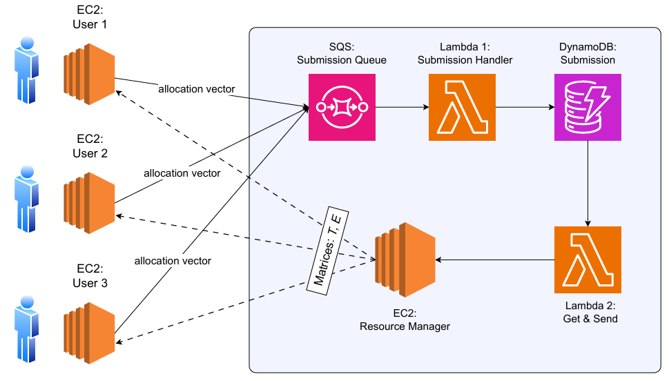
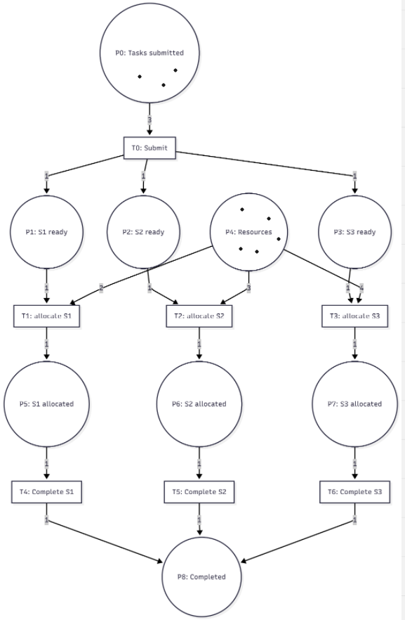

# Cloud Resource Allocation System (AWS)

## Overview

This project implements a cloud-based resource allocation system using AWS services and game-theoretic principles.

The system simulates how multiple users submit computational tasks to a cloud provider and compete for shared resources, balancing execution time and cost to maximize their utility. 

The architecture is distributed and built using AWS components such as EC2, SQS, Lambda, and DynamoDB.

---

## Architecture


The system is divided into two main parts:

### 1. User Side (EC2 Instances)

- Each user runs a Python Flask application on an EC2 instance
- Responsible for:
  - Computing optimal resource allocation
  - Sending allocation decisions
  - Receiving updated results from the cloud provider

### 2. Cloud Provider

The cloud provider consists of:

- **SQS (Submission Queue)**  
  Receives allocation vectors from users

- **Lambda 1 (Submission Handler)**  
  Processes queue messages and stores them in DynamoDB

- **DynamoDB (Submission Table)**  
  Stores allocation vectors and metadata

- **Lambda 2 (Get & Send)**  
  Collects all user submissions and forwards them to the Resource Manager

- **Resource Manager (EC2 Flask App)**  
  Core component that:
  - Computes execution time (T) and cost (E) matrices
  - Handles resource multiplexing
  - Sends results back to users

This architecture follows the assignment design where preprocessing is handled by serverless components and the main logic runs on EC2. :contentReference[oaicite:1]{index=1}

---

## Problem Description

The system models a resource allocation problem where:

- Multiple users submit tasks consisting of subtasks
- Tasks must be assigned to shared cloud resources
- Each resource has:
  - execution time
  - cost

Each user aims to:

- minimize execution time
- minimize cost
- maximize utility

Utility is defined as:

```
u = 1 / (w_t * max_time + w_e * total_cost)
```

where:
- `w_t`: weight for execution time
- `w_e`: weight for cost

---

## System Workflow

### Step 1: Independent Optimization

1. Each user computes optimal allocation assuming no competition
2. Allocation vectors are sent to SQS
3. Data flows through:
   - SQS → Lambda 1 → DynamoDB → Lambda 2 → Resource Manager
4. Resource Manager:
   - builds allocation matrix
   - computes:
     - execution time matrix (T)
     - expense matrix (E)
5. Results are sent back to users

### Step 2: Updated Optimization

1. Resource Manager updates execution times using:

```
t_hat_new[i][j] = t_hat[i][j] + (t[i][j] / n[j])
```

2. Users recompute optimal allocation using updated values
3. Process repeats
4. Final utilities are calculated

---

## Key Concepts

### Resource Multiplexing

When multiple users use the same resource:

```
t[i][j] = n[j] * t_hat[i][j]
```

- `n[j]`: number of users using resource j
- leads to increased execution time

---

### Allocation Matrix

Represents assignment of subtasks to resources:

```
a[i][j] ∈ {0,1}
```

- rows → users
- columns → resources

---

## Technologies Used

- Python (Flask)
- AWS EC2
- AWS Lambda
- AWS SQS
- AWS DynamoDB
- NumPy

---

## Example Execution Flow

### Step 1 Output (User)

```
[User 1] STEP 1: Starting optimization calculation...
Allocation vector: [0, 0, 0, 1, 1]
Expected utility: 0.122489
```

### Step 1 Output (Resource Manager)

```
Received allocations:
User 1: [0, 0, 0, 1, 1]
User 2: [0, 1, 1, 1, 0]
User 3: [1, 1, 1, 0, 1]

T matrix:
[[0 0 0 7 6]
 [0 8.4 7.2 6 0]
 [4 7 6.4 0 4.8]]
```

### Step 2 Output (User)

```
[User 1] STEP 2:
New allocation: [0, 1, 1, 0, 0]
Expected utility: 0.114811
```

---

## Implementation Details

### User Application

- Flask API endpoints:
  - `/calculate` → Step 1 optimization
  - `/calculate_step2` → Step 2 optimization
  - `/update` → receive results from provider

- Uses brute-force search to find optimal allocation

---

### Resource Manager

- Computes:
  - T matrix (execution time)
  - E matrix (cost)
- Applies multiplexing effects
- Sends updates to users

---

### Lambda Functions

#### Lambda 1
- Triggered by SQS
- Stores submissions in DynamoDB

#### Lambda 2
- Reads all submissions
- Sends them to Resource Manager
- Updates status

---

## Limitations

- Uses brute-force (not scalable for large systems)
- No fault tolerance handling
- Requires manual configuration of IP addresses
- Designed for educational purposes

## Petri Net Model


